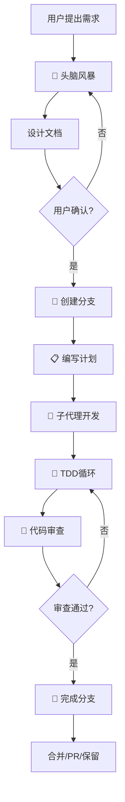

# Superpowers 中文总结

## 📌 概述

**Superpowers** 是一个为编码代理设计的完整软件开发工作流系统。它基于一套可组合的"技能"模块和初始指令构建，使代理能够有效地进行编程工作，自动触发相关技能，无需手动干预。

> [!tip] 核心优势
> 代理能在**无偏离计划的情况下自主工作数小时**，完成从需求理解到实现验证的完整系统化流程。

---

## 🔄 核心工作流程

Superpowers 按照以下七个阶段依次进行：

### 1. 🧠 头脑风暴阶段 (Brainstorming)
- **触发时机**：编写代码前
- **工作内容**：
  - 通过 Socratic 方法提问，深入理解需求
  - 探索多个设计方案和替代方案
  - 分块展示设计方案供用户验证
  - 保存设计文档供后续参考

### 2. 🌳 Git 分支工作流 (Using Git Worktrees)
- **触发时机**：设计获批后
- **工作内容**：
  - 创建隔离的开发工作区
  - 运行项目设置和初始化
  - 验证测试基线是否干净

### 3. 📋 计划编写 (Writing Plans)
- **触发时机**：获得批准的设计
- **工作内容**：
  - 将工作分解为细粒度任务（2-5 分钟每个）
  - 为每个任务明确指定完整文件路径和代码
  - 包含清晰的验证步骤和检查清单

### 4. 🤖 子代理驱动开发 (Subagent-Driven Development)
- **触发时机**：计划确认后
- **工作流程**：
  - 为每个任务分派独立的子代理
  - 执行两阶段审查：
    1. **规范符合度**：检查是否满足计划要求
    2. **代码质量**：审查代码的质量和最佳实践
  - 或分批执行计划，含人工检查点

### 5. 🧪 测试驱动开发 (Test-Driven Development)
- **触发时机**：实现阶段
- **工作流程**：强制执行 **RED-GREEN-REFACTOR** 循环
  1. 🔴 **RED**：编写一个会失败的测试
  2. 🟢 **GREEN**：编写最小化代码使测试通过
  3. 🔵 **REFACTOR**：优化代码并重新运行测试
  4. ✅ **COMMIT**：提交已验证的代码

> [!warning] 重要约束
> 删除任何在编写测试之前编写的代码，确保测试优先。

### 6. 👀 代码审查 (Requesting Code Review)
- **触发时机**：任务间隙
- **工作内容**：
  - 根据计划审查代码
  - 按严重程度分类报告问题
  - **关键问题**会阻断进度继续

### 7. 🏁 分支完成 (Finishing a Development Branch)
- **触发时机**：所有任务完成
- **工作内容**：
  - 验证所有测试通过
  - 呈现完成选项：
    - 合并到主分支
    - 创建 Pull Request
    - 保留分支
    - 丢弃分支
  - 清理工作树和临时资源

> [!note]
> 代理在执行任何任务前都会检查是否有相关技能，这些是强制工作流而非建议。

---

## 📚 技能库详解

### 🧪 测试技能

| 技能名称 | 功能描述 |
|---------|--------|
| **test-driven-development** | RED-GREEN-REFACTOR 循环 + 测试反模式参考库 |

### 🐛 调试技能

| 技能名称 | 功能描述 |
|---------|--------|
| **systematic-debugging** | 4 阶段根本原因追踪（含根因追踪、深度防御、条件等待技术） |
| **verification-before-completion** | 实施完成前验证，确保问题真正解决 |

### 👥 协作技能

| 技能名称 | 功能描述 |
|---------|--------|
| **brainstorming** | Socratic 设计精炼 |
| **writing-plans** | 详细的实现计划 |
| **executing-plans** | 分批执行 + 人工检查点 |
| **dispatching-parallel-agents** | 并发子代理工作流 |
| **requesting-code-review** | 审查前检查清单 |
| **receiving-code-review** | 反馈响应工作流 |
| **using-git-worktrees** | 并行开发分支 |
| **finishing-a-development-branch** | 合并/PR 决策工作流 |
| **subagent-driven-development** | 快速迭代 + 两阶段审查 |

### ⚙️ 元技能

| 技能名称 | 功能描述 |
|---------|--------|
| **writing-skills** | 按最佳实践创建新技能（含测试方法论） |
| **using-superpowers** | Superpowers 技能系统介绍 |

---

## 💡 核心哲学原则

Superpowers 遵循以下四大设计原则：

| 原则 | 描述 |
|------|------|
| **测试驱动开发** 🧪 | 始终先编写测试，确保代码质量 |
| **系统化优于临时性** 📊 | 依靠清晰流程而非临时决策 |
| **降低复杂度** 🎯 | 将简洁视为主要目标，避免过度设计 |
| **证据优于声明** ✔️ | 通过验证来声明成功，而非仅凭承诺 |

> [!quote]
> "Code written before tests get written is deleted." - Superpowers Philosophy

---

## 🚀 安装指南

### Claude Code（推荐）

1. **注册市场商城**：
```bash
/plugin marketplace add obra/superpowers-marketplace
```

2. **安装插件**：
```bash
/plugin install superpowers@superpowers-marketplace
```

3. **验证安装**：
```bash
/help
```

应该看到以下命令：
- `/superpowers:brainstorm` - 交互式设计精炼
- `/superpowers:write-plan` - 创建实现计划
- `/superpowers:execute-plan` - 分批执行计划

### Codex
告诉 Codex：
```
Fetch and follow instructions from https://raw.githubusercontent.com/obra/superpowers/refs/heads/main/.codex/INSTALL.md
```

### OpenCode
告诉 OpenCode：
```
Fetch and follow instructions from https://raw.githubusercontent.com/obra/superpowers/refs/heads/main/.opencode/INSTALL.md
```

---

## 🔄 实际工作流程示例



---

## 🔧 更新和维护

### 自动更新
技能在更新插件时自动更新：
```bash
/plugin update superpowers
```

### 贡献新技能

1. Fork 项目仓库
2. 为你的技能创建分支
3. 遵循 `writing-skills` 技能指南
4. 提交 Pull Request

详见：`skills/writing-skills/SKILL.md`

---

## 📖 相关资源

- **博客文章**：[Superpowers for Claude Code](https://blog.fsck.com/2025/10/09/superpowers/)
- **GitHub Issues**：https://github.com/obra/superpowers/issues
- **Marketplace**：https://github.com/obra/superpowers-marketplace

---

## 📄 许可证

MIT License - 详见 LICENSE 文件

---

## 🙏 致谢

Superpowers 由 Jesse 创建维护。如果本项目帮助你完成了有商业价值的工作，欢迎[赞助开源工作](https://github.com/sponsors/obra)。

---

**最后更新**：2026-01-20
**原始文档**：[[技术学习文档/Superpowers文档.md]]
