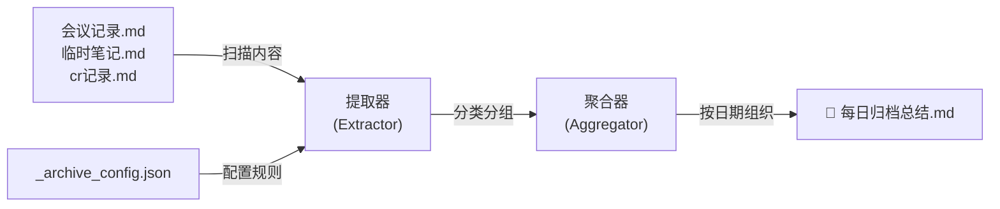

# 📚 每日归档 Skill 使用指南

## 🎯 功能概述

**每日自动聚合** [[会议记录]]、[[临时笔记]]、[[cr记录]] 的核心内容，按日期组织到 [[每日归档总结.md]] 中。

---

## 🚀 快速开始

### 方式 1️⃣: 直接运行脚本（推荐）

```bash
node archive-daily.js
```

**效果**：
```
🚀 开始归档更新...

📋 配置已加载: 3个数据源

✅ 已保存: 每日归档总结.md
✅ 归档更新完成！
📄 查看: [[每日归档总结.md]]
```

### 方式 2️⃣: 在编辑器中执行（未来实现）

```
/archive-daily
```

---

## 🔧 工作原理



### 处理流程

```
1. 读取 3 个源文件
   ↓
2. 提取有效内容（跳过空行、注释、代码块）
   ↓
3. 按类别分组（会议、临时笔记、CR）
   ↓
4. 生成今日章节
   ↓
5. 在归档文档中更新
   ↓
6. 更新历史记录统计
```

---

## 📋 配置说明

### 文件: `_archive_config.json`

| 字段 | 说明 | 例值 |
|------|------|------|
| `sources` | 数据源列表 | 会议记录、临时笔记等 |
| `category` | 显示分类 | 📌 会议记录 |
| `output.path` | 输出文档路径 | 每日归档总结.md |
| `schedule.command` | 触发命令 | /archive-daily |

### 自定义数据源

想添加新的数据源？编辑 `_archive_config.json`:

```json
{
  "sources": [
    {
      "path": "你的新文件.md",
      "category": "📌 新类别",
      "enabled": true,
      "priority": 4
    }
  ]
}
```

---

## 📊 输出示例

### 生成的每日归档格式

```markdown
## 2026年1月21日

### 📌 会议记录
- 核心方向: 工程化 + 要有提效
- 全流程工具: /tddc + /claude code + /agent + /skill

### 📝 临时笔记
- git workspace 多 agent 协同
- 浏览器元素快速定位

### 🔍 CR 记录
- 时间字段: 用 unix() 替代 format('X')
- 国际化: 环境变量正确写法

---

## 📋 历史记录

- **2026-01-21**: 3条 (会议+临时+CR)
- **2026-01-20**: 2条
```

---

## ✅ 使用建议

### 日常工作流程

1. **每天创建内容** → [[会议记录]]、[[临时笔记]]、[[cr记录]]
2. **下班前运行** → `node archive-daily.js`
3. **查看总结** → [[每日归档总结.md]]
4. **长期沉淀** → 识别重复模式、最佳实践

### 优化建议

- ✅ 定期备份 `每日归档总结.md`（重要文档）
- ✅ 每月从历史记录中提取关键洞察
- ✅ 可选：添加 Frontmatter 标记增强元数据
- ✅ 可选：集成 Cron 定时任务自动化运行

---

## 🔍 常见问题

### Q1: 脚本找不到源文件？
**A**: 检查 `_archive_config.json` 中的文件路径是否正确。相对路径应该从 vault 根目录开始。

```json
// ✅ 正确
"path": "会议记录.md"

// ❌ 错误
"path": "/会议记录.md"
```

### Q2: 输出文件中内容重复？
**A**: 脚本默认直接插入新内容。如果多次运行会有重复。推荐:
- 选项 1: 检查 `最后更新` 时间戳，仅在隔天运行
- 选项 2: 手动清理重复内容

### Q3: 如何只更新特定类别？
**A**: 在 `_archive_config.json` 中禁用其他源:

```json
{
  "enabled": false  // 禁用此数据源
}
```

### Q4: 如何恢复误删的内容？
**A**:
1. 检查 Git 历史（如果已初始化）
2. 从源文件（会议记录等）重新生成
3. 手动编辑 `每日归档总结.md`

---

## 🎨 扩展功能（未来）

- [ ] **周报生成** → 自动汇总周内容生成周报
- [ ] **AI 摘要** → 调用 Claude API 生成智能摘要
- [ ] **搜索索引** → 为归档内容建立全文搜索
- [ ] **Dataview 集成** → 实时看板展示

---

## 📞 技术栈

| 组件 | 技术 | 说明 |
|------|------|------|
| 脚本 | Node.js | `archive-daily.js` |
| 配置 | JSON | `_archive_config.json` |
| 输出 | Markdown | [[每日归档总结.md]] |
| 触发 | 手动 / Cron | 灵活选择 |

---

## 🔗 相关文件

- 📄 [[每日归档总结.md]] - 输出文档
- ⚙️ [[_archive_config.json]] - 配置文件
- 🚀 [[archive-daily.js]] - 主脚本
- 💡 [[灵感记录.md]] - 快速操作指令
- 📖 本文档 - 使用指南

---

**创建日期**: 2026-01-21 | **版本**: 1.0 | **状态**: ✅ 就绪

---
